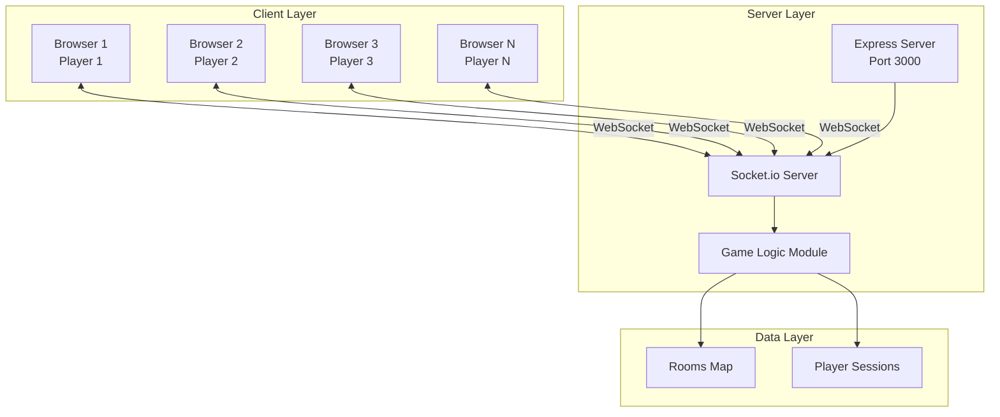
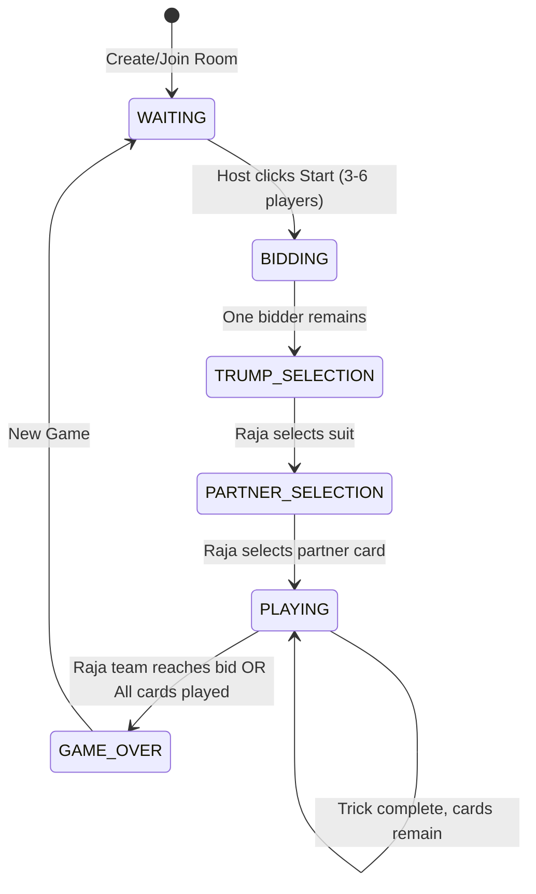
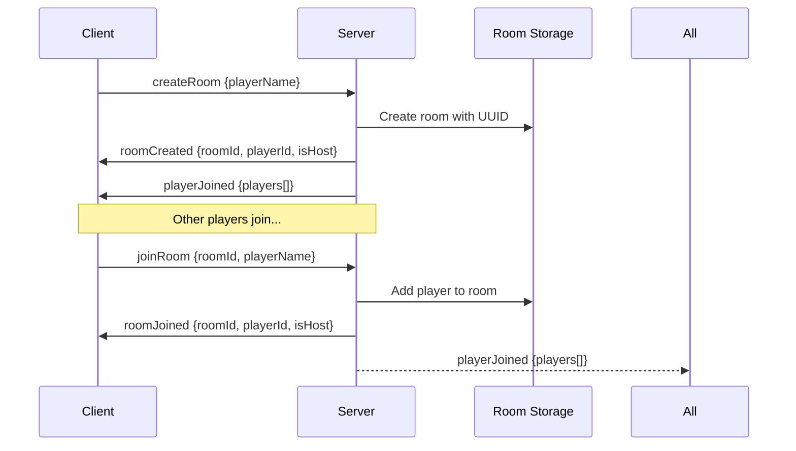
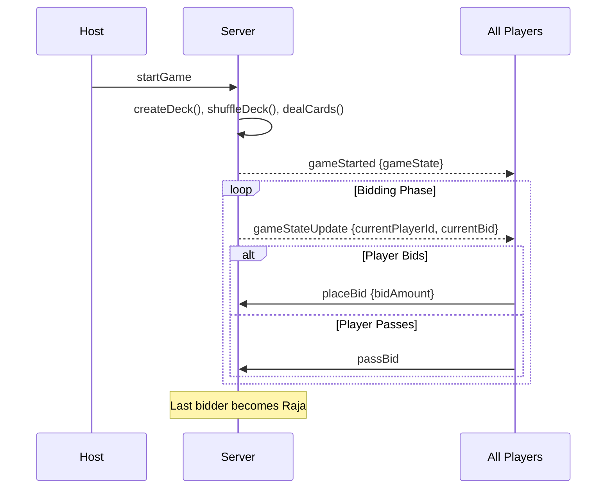
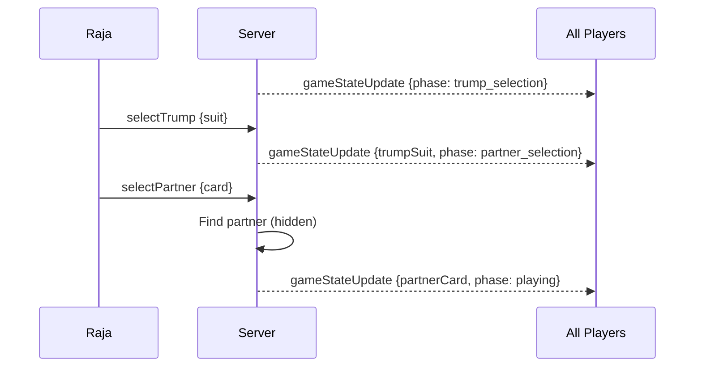
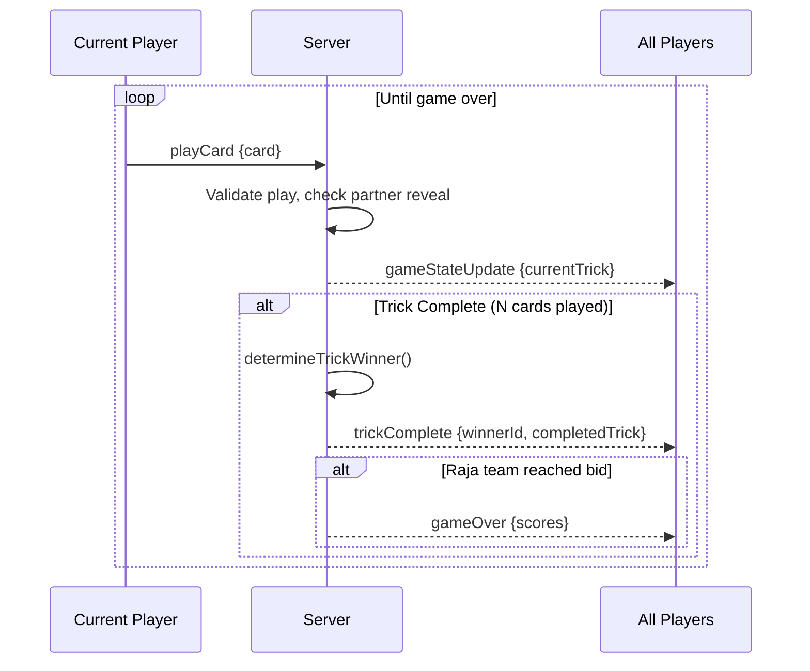

# Kaali Rani - Architecture Documentation

A real-time multiplayer card game built with Node.js, Express, and Socket.io.

---

## System Architecture



---

## Project Structure

```
Kaali Raani/
├── server.js        # Express + Socket.io server, game orchestration
├── gameLogic.js     # Pure game logic functions (deck, scoring, rules)
├── package.json     # Dependencies
└── public/
    ├── index.html   # UI with Tailwind CSS
    ├── game.js      # Client-side Socket.io handling
    └── styles.css   # Custom card and table styles
```

---

## Game Flow State Machine



---

## Socket.io Message Flow

### Room Creation & Joining



### Game Start & Bidding



### Trump & Partner Selection



### Playing Phase



---

## Key Server Events

| Event | Direction | Payload | Description |
|-------|-----------|---------|-------------|
| `createRoom` | C→S | `{playerName}` | Create new game room |
| `roomCreated` | S→C | `{roomId, playerId, isHost}` | Room created confirmation |
| `joinRoom` | C→S | `{roomId, playerName}` | Join existing room |
| `roomJoined` | S→C | `{roomId, playerId, isHost}` | Join confirmation |
| `playerJoined` | S→All | `{players[]}` | Player list update |
| `startGame` | C→S | - | Host starts game |
| `gameStarted` | S→All | `{gameState}` | Game begins, cards dealt |
| `placeBid` | C→S | `{bidAmount}` | Place a bid |
| `passBid` | C→S | - | Pass on bidding |
| `selectTrump` | C→S | `{suit}` | Raja selects trump |
| `selectPartner` | C→S | `{card}` | Raja selects partner card |
| `playCard` | C→S | `{card}` | Play a card |
| `gameStateUpdate` | S→All | `{gameState}` | State sync after actions |
| `trickComplete` | S→All | `{winnerId, completedTrick}` | Trick ended |
| `gameOver` | S→All | `{scores}` | Game finished |

---

## Game State Object

```javascript
{
  roomId: "ABC123",
  phase: "playing",
  myHand: [{suit, rank}, ...],        // Player's cards
  otherPlayers: [{id, name, cardCount}, ...],
  playerOrder: [{id, name}, ...],
  currentPlayerId: "uuid",            // Whose turn
  currentBid: 75,
  rajaId: "uuid",
  trumpSuit: "spades",
  partnerCard: {suit: "hearts", rank: "A"},
  partnerRevealed: false,
  currentTrick: [{playerId, playerName, card}, ...],
  allPlayersPoints: {playerId: {name, points}, ...}
}
```

---

## Scoring System

| Card | Points |
|------|--------|
| Ace | 10 |
| 10 | 10 |
| 5 | 5 |
| Queen of Spades (Kaali Rani) | 30 |
| Others | 0 |

**Win Condition**: Raja team must reach their bid. Game ends early if they do.

---

## Client-Side Features

- **Turn Indicator**: 2-second popup when it's your turn
- **Timeout Warning**: After 30 seconds, reminder flashes
- **Trick Delay**: Cards visible for 10 seconds after trick ends
- **Card Sorting**: Black-Red-Black-Red (♠, ♥, ♣, ♦)
- **Live Scorecard**: All players' points visible in real-time
